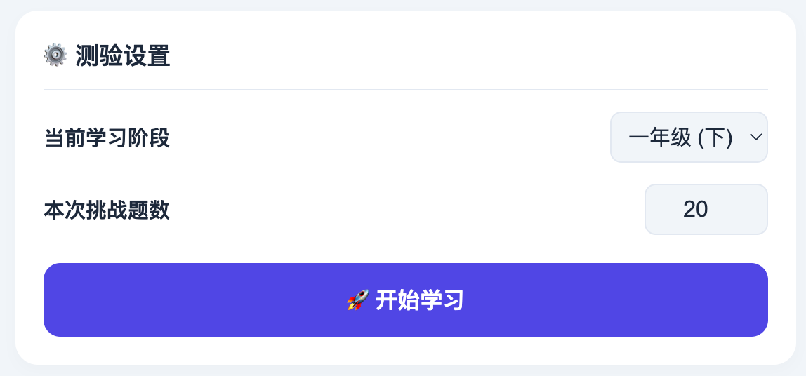
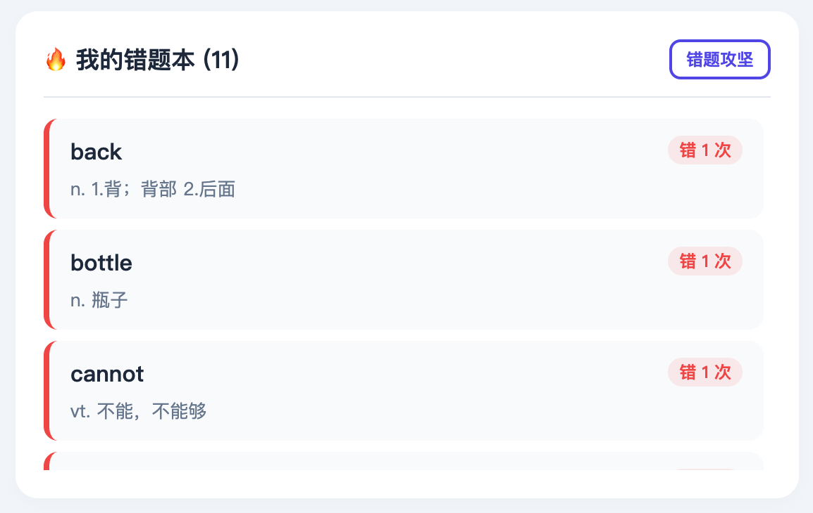
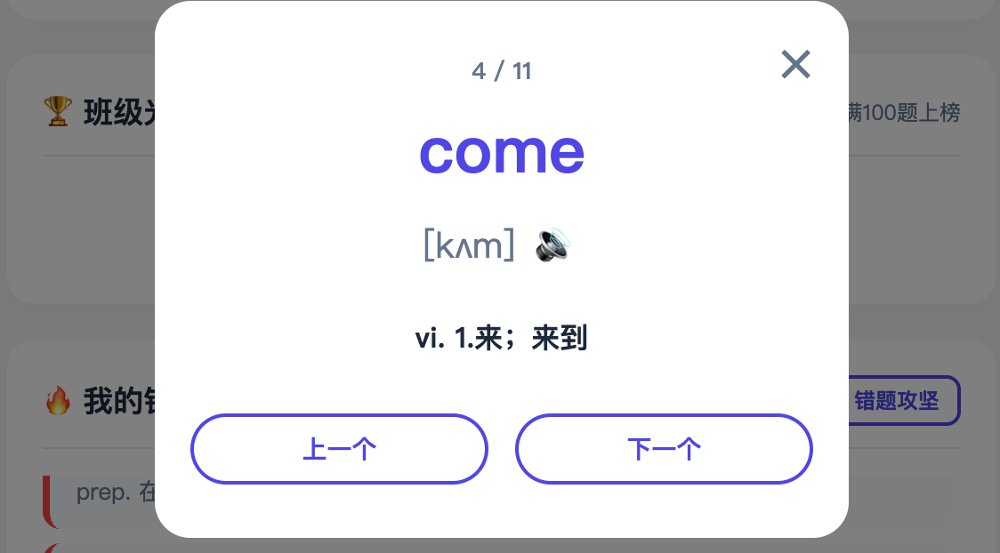
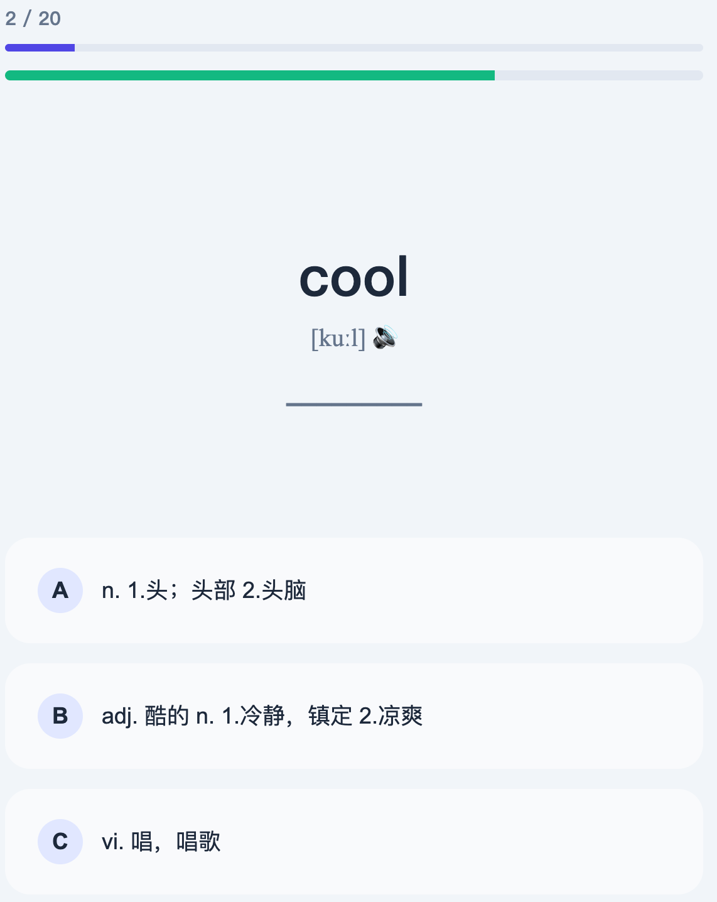

# 🌟 每日英语挑战 (English Words Challenge PWA)

这是一个专为小学生设计的轻量级、智能化的英语单词测验与打卡系统。

本来是准备做英语闪卡给小朋友学习的，后来觉得实物制作比较麻烦，就萌生了做个页面的想法。

## 👀展示

### 登陆界面


### 个人界面

- 数据概览


- 测验设置


- 错题本


- 错题复习


- 光荣榜


- 打卡日历


- 题目


## ✨ 核心特性

* 📱 **PWA 支持** ：保存到桌面后，与App一致
* 🗣️ **双语发音** ：调用原生 Web Speech API，纯正英式男声与女声自动交替朗读，有效防止“听觉疲劳”，强化发音特征记忆。
* 🧠 **智能题库与错题本** ：支持按年级动态抽取词库，带有本地防重复机制，独立的“错题本”模式
* ⚡ **极简主义的词库架构** ：采用极简的 `单词 | 音标 | 释义` 的 txt 纯文本格式当作题库，维护简单
* 🐳 **一键傻瓜式部署** ：程序Docker化，直接拉起包含 Flask 后端和 SQLite 数据库的完整服务

## 🛠️ 技术栈

* **前端**：HTML5, CSS3, 原生 JavaScript (无框架，追求极致轻量) + PWA (Service Worker, Manifest)
* **后端**：Python 3, Flask
* **数据库**：SQLite (纯本地轻量级存储)
* **部署**：Docker, Docker Compose

## 📁 核心目录结构

```text
├── app.py                  # Flask 后端主程序
├── generate_words/         # 词库生成与存放目录
│   ├── build_words.py      # 将大纲词汇匹配英汉字典生成标准 txt 的构建脚本
│   └── words.txt           # 极简格式的词库文件
├── assets/                 # 前端静态资源
│   ├── images/             # 图片
│   ├── js/                 # 包含 ui.js (发音控制), quiz.js (测验逻辑), sw.js (缓存策略)
│   └── css/                # 样式表
├── index.html              # 主页面
├── manifest.json           # PWA 身份配置
├── sw.js                   # Service Worker
├── requirements.txt        # Python 依赖清单 (Flask, gunicorn 等)
├── 班级名单.txt             # 用于注册验证
├── 现代英汉词典.json         # 字典文件
└── Dockerfile              # Docker 镜像构建文件

## 🚀 快速部署指南

1. 克隆项目

 ```
 git clone https://github.com/luuaiyan/EnglishWordsChallenge.git
 cd EnglishWordsChallenge
 ```

2. 一键启动
确保你的服务器已安装 Docker 和 Docker Compose。在项目根目录下执行：

 ```
 docker compose up -d
 ```

服务启动后，打开浏览器访问 `http://你的服务器IP:5000` 即可开始体验！

> 系统会自动初始化一个全新的 SQLite 数据库用于存放成绩与错题。

## 📚 **关于词库生成的说明(重要）**

由于不同阶段，小朋友学习的知识也是不同的，一个单词有很多释义，即使通过本地字典或者网上爬虫相关的信息对学习的帮助意义不大，因此：**题库的维护基本需要自行手动**！

本项目内置了词库打包脚本 `generate_words/build_words.py`，它可以帮助从 `现代英汉词典.json` 中抓取音标和翻译，顺便完成自动去重和排版。

使用方法：
1. generate_words 目录下放一个`words_input.txt`，内容是单词（每行一个）
2. 运行 `python3 build_words.py`，提示输入的文件，即`words_input.txt`，输出文件名任意，会得到`单词 | 音标 | 释义`这样内容的txt文件，推荐使用VScode安装Rainbow CSV等插件进行整理

**词库读取：**

本程序默认会读取 generate_words 目录下的文件：

 - `一年级上学期` 对应 `words_1a.txt`
 - `一年级下学期` 对应 `words_1b.txt`
 - `二年级上学期` 对应 `words_2a.txt`
 - `二年级下学期` 对应 `words_2b.txt`
 - `三年级上学期` 对应 `words_3a.txt`
 - `三年级下学期` 对应 `words_3b.txt`
 - `四年级上学期` 对应 `words_4a.txt`
 - `四年级下学期` 对应 `words_4b.txt`
 - `五年级上学期` 对应 `words_5a.txt`
 - `五年级下学期` 对应 `words_5b.txt`
 - `六年级上学期` 对应 `words_6a.txt`
 - `六年级下学期` 对应 `words_6b.txt`

 > 如果目录中没有这些文件，回退检索 `words.txt` 作为备用题库

⚠️ 注意

根目录的 `班级名单.txt` 需要填写小朋友注册的名称，假设班级小朋友叫：张三，填写保存后，张三可以在首页进行注册，否则无法注册。

毕竟程序创建的初衷，是给班级的小朋友日常学习相关词汇的积累使用，最大的原因也是全国每个地区学习的内容都不一致，无法将每个年级每个学期学习的单词一次性做到位。

🤝 说明

“让每天的英语打卡，变成一件轻松又期待的小事。”

